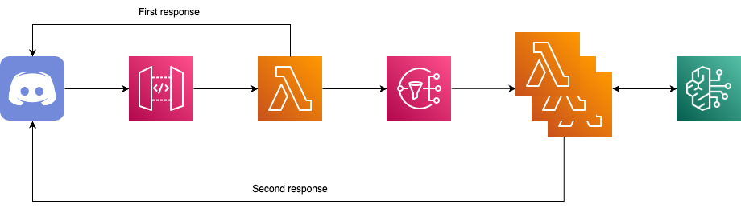

<h1 align="center">🎀 Lady Claude 🎀</h1>

<div align="center">
  
  
  
  
  
</div>

<br>

<div align="center">
  <blockquote>
  ごきげんよう!!<br>
  そうですわ!!素敵な日差しの中お庭でお茶を飲むのはいかがでしょうか?<br>
  </blockquote>
</div>

## 🌟 Overview

**Lady Claude**(Claudeお嬢様)は、AWS上で動作するサーバレスのDiscord Botです。

Botとしての回答の生成にAmazon Bedrockの**Claude 3 Haiku**を使用しており、さながらお嬢様のように回答してくれます。

<br>

<div align="center">
  
</div>

## 🛠️ Develop

### 依存関係のインストール

Pythonのパッケージ管理に**Poetry**を使用しています。

```
$ poetry install
```

### ツールの実行

Discord Botへのコマンド登録などは、`tools`以下のツールを利用して行います。

```
$ poetry run python tools/xxx.py
```

## 🚀 Build & Deploy

### SSMパラメータの作成

事前にDiscord Applicationを作成し、設定情報をSSMパラメータとして以下のように設定する必要があります。

- `/LADY_CLAUDE/DISCORD_APPLICATION_ID`: Discord ApplicationのアプリケーションID

- `/LADY_CLAUDE/DISCORD_BOT_TOKEN`: Discord Botのトークン

- `/LADY_CLAUDE/DISCORD_GUILD_ID`: Discord Botを利用するサーバのID

- `/LADY_CLAUDE/DISCORD_PUBLIC_KEY`:Discord Applicationのパブリックキー

### アプリケーションのビルドとAWSへのデプロイ

Poetryのタスクランナーとして**Poethepoet**を使用しており、AWSへのデプロイツールとして**AWS SAM**を使用しています。

```
$ poe build & poe deploy
```

> ⚠️ `poe build`を実行すると、自動的に依存関係を`requirements.txt`としてエクスポートするため、`poetry add <パッケージ名>`を実行するだけでLambdaに依存関係が追加される。
