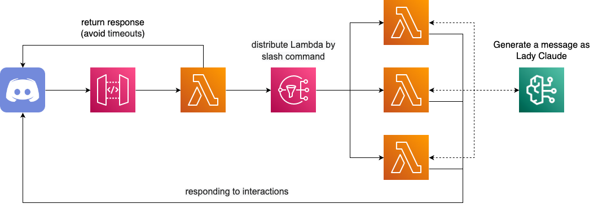

<h1 align="center">🎀 Lady Claude 🎀</h1>

<div align="center">
  
  
  
  
  
</div>

<br>

<div align="center">
  <blockquote>
  ごきげんよう!!<br>
  そうですわ!!素敵な日差しの中、お庭でお茶でもいかがかしら?
  </blockquote>
</div>

## 🌟 Overview

**Lady Claude**(Claudeお嬢様)は、AWS上で動作するサーバレスのDiscord Botです。

DiscordのWebhookで受け取ったSlash commandsのコマンドごとに、Amazon SNSで処理を行うLambdaを振り分けます。

また、Discord Botとしてのメッセージの生成にAmazon Bedrockの**Claude3 Sonnet**を使用しており、さながらお嬢様のように回答してくれます。

<div align="center">
  
</div>

## 💡 Usage

対象となるサーバにClaudeお嬢様を追加し、Slash commandsを呼び出すことで使用することができます。

現在は、以下のslash commandsを利用することができます。

#### 🤔 [`ask`](https://github.com/UniUrchin/lady-claude/blob/main/documents/ask-architecture.md)

- Claudeお嬢様に何でも質問してみましょう!!

#### ⛏️ [`minecraft`](https://github.com/UniUrchin/lady-claude/blob/main/documents/minecraft-architecture.md)

- Claudeお嬢様にMinecraft Serverを操作してもらいましょう!!

## 🚧 Develop

### 依存関係のインストール

Pythonのパッケージ管理に**Poetry**を使用しています。

```
$ poetry install
```

### ツールの実行

Discord Botへのコマンド登録などは、`tools`以下のツールを利用して行います。

```
$ poetry run python tools/xxx.py
```

## 🚀 Build & Deploy

### SSMパラメータの作成

事前にDiscord Applicationを作成し、以下の設定情報をSSMパラメータとして作成する必要があります。

- `/LADY_CLAUDE/DISCORD/APPLICATION_ID`: Discord ApplicationのアプリケーションID

- `/LADY_CLAUDE/DISCORD/BOT_TOKEN`: Discord Botのトークン

- `/LADY_CLAUDE/DISCORD/PUBLIC_KEY`:Discord Applicationのパブリックキー

> [!WARNING]
> 使用するコマンドによっては上記以外のパラメータやリソースが必要になる場合がありますので、各Slash commandsのREADME.mdを参照してください。

### アプリケーションのビルドとAWSへのデプロイ

Poetryのタスクランナーとして**Poethepoet**を使用しており、AWSへのデプロイツールとして**AWS SAM**を使用しています。

```
$ poe build & poe deploy
```
