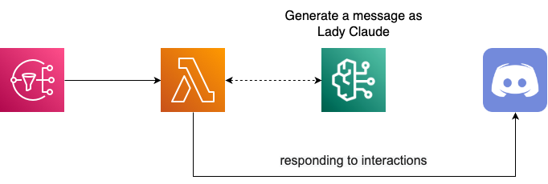

<h1 align="center">🎀 Lady Claude - ask 🎀</h1>

<div align="center">
  <blockquote>
  紅茶はお湯の温度が大切ですわ!!<br>
  熱すぎるとビターになってしまいますから、注意してくださいまし!!
  </blockquote>
</div>

## 🌟 Overview

**ask**コマンドでは、Claudeお嬢様に何でも質問することができます。

引数に受け取った質問を直接Amazon Bedrockの**Claude 3.5 Sonnet**に渡し、お嬢様風の回答を生成します。

また、回答の最後には出力のトークン数を元に算出した回答に対する料金が表示されます。

<div align="center">
  
</div>

## 💡 Usage

以下の形式でDiscordのSlash commandを入力してください。

```
/ask {question}
```

- `question`: Claudeお嬢様に質問したい内容

## 🧱 Additional Infrastructure

### モデルアクセスの有効化

LLMによる回答を生成するために、Amazon BedrockのコンソールからClaude 3.5 Sonnetのモデルアクセスを有効化する必要があります。

> [!WARNING]
> 2024年6月現在、Claude 3.5 Sonnetはバージニア北部リージョンでしか利用できないため、モデルアクセス有効化の際には注意してください。
