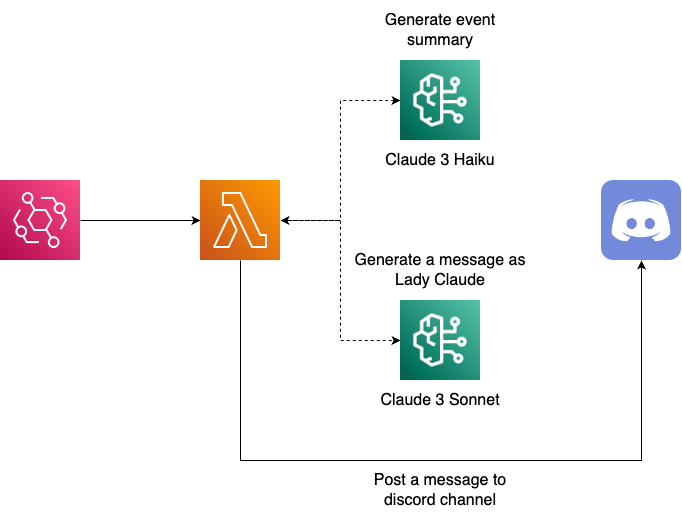

<h1 align="center">🎀 Lady Claude - connpass 🎀</h1>

  <blockquote>
  わたくしがConnpassで見つけた楽しそうなイベントをご紹介しますわ!! 
  気になるイベントがおありでしたら、ぜひ参加してみてはいかがかしら?
  </blockquote>

> [!CAUTION]
> 2024年9月1日より、Connpassサイトへのスクレイピング禁止が利用規約に明記されたため、この機能はDeprecatedになりました。

## 🌟 Overview

**connpass**サービスでは、Claudeお嬢様が定期的にconnpassから気になるイベントを収集し、その開催概要や日程などのサマリを通知してくれます。

収集したイベントの要約には**Claude 3 Haiku**、要約を元にした回答の生成には**Claude 3.5 Sonnet**を使用しています。

connpassからの情報抽出にはAPIが提供されていますが、固定IPに対してのみアクセストークンが払い出されるため、Claudeお嬢様ではイベントページへのスクレイピングで対応しています。

  

## 💡 Usage

このサービスは定期的に実行されるため、特にユーザからアクションを行う必要はありません。

## 🧱 Additional Infrastructure

### モデルアクセスの有効化

LLMによる回答を生成するために、Amazon BedrockのコンソールからClaude 3 HaikuとClaude 3.5 Sonnetのモデルアクセスを有効化する必要があります。

> [!WARNING]
> 2024年6月現在、Claude 3 HaikuおよびClaude 3.5 Sonnetはバージニア北部リージョンでしか利用できないため、モデルアクセス有効化の際には注意してください。
