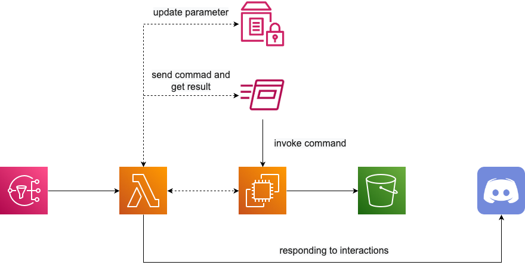

<h1 align="center">🎀 Lady Claude - minecraft 🎀</h1>

<div align="center">
  <blockquote>
  ふふっ、遊びたいのかしら?<br>
  でしたら、わたくしにサーバの起動を命じてくださいまし!!
  </blockquote>
</div>

## 🌟 Overview

**minecraft**コマンドでは、同じAWS環境のEC2インスタンスとして作成されているMinecraftサーバを、Claudeお嬢様に操作してもらうことができます。

Claudeお嬢様で可能な操作には、サーバの起動や停止に加えて、バックアップの取得やワールドの切り替えなど便利な機能が揃っています。

<div align="center">
  
</div>

## 💡 Usage

以下の形式でDiscordのSlash commandを入力してください。

```
/minecraft {action}
```

- `action`: Claudeお嬢様に行ってもらいたいアクション

  - `start`: Minecraftサーバを起動する

  - `stop`: Minecraftサーバを停止する

  - `status`: Minecraftサーバの状態を確認する

  - `backup`: 選択されているワールドのバックアップをS3に出力する

## 🧱 Additional Infrastructure

### EC2インスタンスとバックアップ用S3バケットの作成

MinecraftサーバをホストするEC2インスタンスとワールドのバックアップを保管するためのS3バケットは、事前に作成する必要があります。

また、Minecraftサーバの起動にはSystems Managerの**Run Command**を使用するため、EC2インスタンスに対して以下の設定を行う必要があります。

- SSMエージェントのインストール

- SSMとS3の実行権限を持ったインスタンスプロファイルのアタッチ

- MCRCONの有効化

- MCRCONに使用する環境変数のエクスポート

  - `MCRCON_HOST`: "localhost"を記載する

  - `MCRCON_PORT`: 任意のポート番号を記載する

  - `MCRCON_PASSWORD`: 任意のパスワードを記載する
