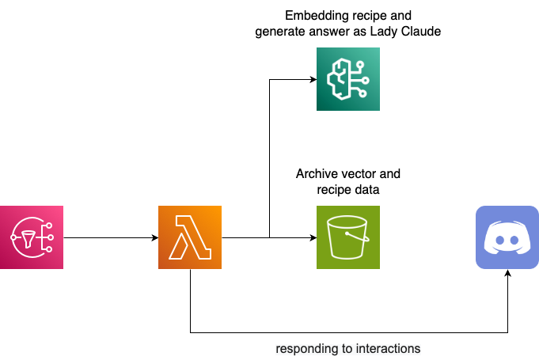

<h1 align="center">🎀 Lady Claude - recipe 🎀</h1>

<div align="center">
  <blockquote>
  まあ!!ジンジャーエールのレシピについて知りたいですの?<br>
  わたくしが爽やかな香りと風味を楽しめるジンジャーエールのレシピを教えてさしあげますわ!!
  </blockquote>
</div>

## 🌟 Overview

**recipe**コマンドでは、Claudeお嬢様にお気に入りのレシピを教えることによって、セマンティックなレシピの検索とレシピに関する質問に対する回答を提供します。

いわゆるRAGとしてサーバレスに動作しており、ベクトル検索には**FAISS**を使用し、インデックスと実データのペアをS3に保管しています。また、レシピのベクトル化には**Amazon Titan Text Embedding V2**、レシピに関する質問への回答には**Claude 3.5 Sonnet**を使用しています。

Claudeお嬢様に覚えさせたレシピを一覧表示する機能や間違って覚えさせたレシピを削除する機能なども搭載されています。

<div align="center">
  
</div>

## 💡 Usage

以下の形式でDiscordのSlash commandを入力してください。

```
/recipe {order}
```

- `order`: Claudeお嬢様に対する命令

`recipe`コマンドでは、入力された`order`の内容から以下の4つの操作のうちどれを実行するのかをLLM Agentで判断します。

- `register`: Claudeお嬢様にレシピを覚えてもらう(`order`には、レシピ名、材料、手順がそれぞれ含まれている必要があります)

- `answer`: 質問に関連するレシピを検索して、レシピに関する質問に回答する

- `list`: Claudeお嬢様が覚えているレシピの一覧を見せてもらう

- `delete`: レシピ名を指定してClaudeお嬢様に特定のレシピを忘れさせます(削除するレシピは、`list`の操作で表示されるレシピ名に含まれている必要があります)。

## 🧱 Additional Infrastructure

### モデルアクセスの有効化

RAGで使用する埋め込みとテキスト生成を使用するために、Amazon BedrockのコンソールからAmazon Titan Text Embeddings V2とClaude 3.5 Sonnetのモデルアクセスを有効化する必要があります。

> [!WARNING]
> 2024年6月現在、Claude 3.5 Sonnetはバージニア北部リージョンでしか利用できないため、モデルアクセス有効化の際には注意してください。
